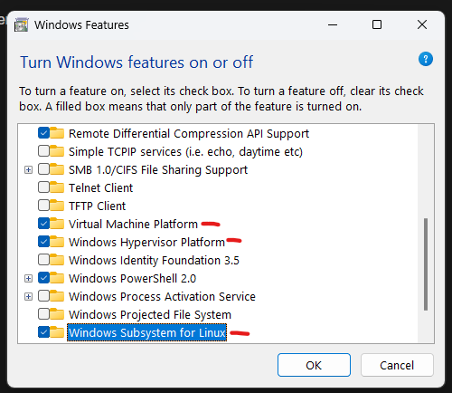

# DevOps Training

- SSH For students
    1. Mubin -  
        
        ```bash
        ssh -i "student.pem" [ubuntu@ec2-13-61-2-211.eu-north-1.compute.amazonaws.com](mailto:ubuntu@ec2-13-61-2-211.eu-north-1.compute.amazonaws.com)
        ```
        
        IP:  ``` curl https://ipinfo.io/ip
 ```
        
    2. Abdulla - 
        
        ```bash
        ssh -i "student.pem" ubuntu@ec2-13-60-83-249.eu-north-1.compute.amazonaws.com
        ```
        
        IP:  13.60.83.249
        
    3. Divya -
        
        ```bash
        ssh -i "student.pem" ubuntu@ec2-13-60-184-214.eu-north-1.compute.amazonaws.com
        ```
        
        IP:  13.60.184.214
        
    4. Anjay - 
        
        ```bash
        ssh -i "student.pem" ubuntu@ec2-16-170-211-42.eu-north-1.compute.amazonaws.com
        ```
        
        IP:  16.170.211.42
        
    5. Shubhasree - 
        
        ```bash
        ssh -i "student.pem" ubuntu@ec2-16-171-137-112.eu-north-1.compute.amazonaws.com
        ```
        
        IP:  16.171.137.112
        
    6. Sreedevi -
        
        ```bash
        ssh -i "student.pem" ubuntu@ec2-13-60-214-95.eu-north-1.compute.amazonaws.com
        ```
        
        IP: 13.60.214.95
        
    7. Summayya - 
        
        ```bash
        ssh -i "student.pem" ubuntu@ec2-13-49-228-70.eu-north-1.compute.amazonaws.com
        ```
        
        IP:  13.49.228.70
        

for ICT Academy 

- Completed Day 1 - Notes & others ( Open the Toggle ) ✅
    - Requirements
        
        1. Cloud concepts including Compute,Storage and Docker Concepts
        
        2. Introducing DevOps 
        
        3. Introducing DevOps with CI/CD on cloud
        
        4. Concepts of AWS Hosting, Code commit, creation of free account and deploying MERN application on cloud.
        
    - Prerequisite
        1. DevOps Explained
            
            [https://youtu.be/scEDHsr3APg](https://youtu.be/scEDHsr3APg)
            
        2. Git Intro
            
            [https://youtu.be/hwP7WQkmECE](https://youtu.be/hwP7WQkmECE)
            
        3. Intro to docker
            
            [https://youtu.be/Gjnup-PuquQ](https://youtu.be/Gjnup-PuquQ)
            
        4. What is CI/CD ( Article )
            
            [What is CI/CD? - GeeksforGeeks](https://www.geeksforgeeks.org/what-is-ci-cd/)
            
        5. What is Cloud Computing
            
            [What Is Cloud Computing ? - GeeksforGeeks](https://www.geeksforgeeks.org/cloud-computing/)
            
        6. Intro to Bash
            
            [https://youtu.be/I4EWvMFj37g](https://youtu.be/I4EWvMFj37g)
            
    
    ---
    
    ***Time schedule for each module may differ**
    
    ---
    
    - **Day 1: Cloud Concepts (Compute, Storage, Docker)**
        
        **Objective**: Introduction to basic cloud concepts, computing services, storage solutions, and Docker for containerization.
        
        ### **9:00 AM - 10:00 AM: Introduction to Cloud Computing**
        
        - **Topics**:
            - Overview of cloud models: IaaS, PaaS, SaaS
            - Public vs. Private vs. Hybrid Clouds
            - Popular cloud providers: AWS, Azure, GCP
        
        ### **10:00 AM - 11:00 AM: Compute Services**
        
        - **Topics**:
            - Virtual Machines (VMs)
            - Serverless computing (Lambda, Functions as a Service)
            - Containers vs VMs
        - **Hands-On**:
            - Launching an EC2 instance (AWS)
            - Walkthrough EC2 Instance.
        
        ### **11:00 AM - 12:00 PM: Cloud Storage Solutions**
        
        - **Topics**:
            - Object storage (Amazon S3)
        - **Hands-On**:
            - Create and manage an S3 bucket
            - Upload files and set permissions on S3
        
        ### **12:00 PM - 1:00 PM: Docker and Containerization**
        
        - **Topics**:
            - Introduction to containers and Docker
            - Docker images, containers, and registries
            - Docker Compose
        - **Hands-On**:
            - Install Docker and run a basic container (Portainer)
            - Build and run a custom Docker image ( Docker Compose )
    
    ---
    
    - **Day 2: Introduction to DevOps**
        
        **Objective**: Understand DevOps concepts, culture, and tools used in automation and collaboration.
        
        ### **9:00 AM - 10:00 AM: What is DevOps?**
        
        - **Topics**:
            - DevOps principles and practices
            - Collaboration between Dev and Ops teams
            - The DevOps lifecycle (CI/CD, Infrastructure as Code, Monitoring)
            - Importance of automation in DevOps
        
        ### **10:00 AM - 11:00 AM: Tools in DevOps**
        
        - **Topics**:
            - Version control systems (Git)
            - Introduction to Configuration management (Ansible, Terraform)
            - Introduction to Continuous Integration tools (GitHub Actions, Jenkins, GitLab CI)
            - Continuous Delivery vs. Continuous Deployment
        - **Hands-On**:
            - Setup Git and GitHub, create a repository
            - Basic Git operations (clone, commit, push, pull)
        
        ### **11:00 PM - 1:00 PM: CI/CD Pipeline Overview**
        
        - **Topics**:
            - Concepts of CI/CD pipeline
            - Integrating CI tools with GitHub
        - **Hands-On**:
            - Setup a GitHub Page
            - Setup a simple CI/CD pipeline using GitHub Action.
    
    ---
    
    - **Day 3: DevOps with CI/CD on Cloud**
        
        **Objective**: Apply DevOps principles by building a full CI/CD pipeline in the cloud.
        
        ### **9:00 AM - 10:00 AM: Continuous Integration (CI) with GitHub Self Hosted Runners**
        
        - **Topics**:
            - Setup GitHub Self Hosted Runners  on EC2 Instance
            - Basic GitHub Deployment job creation on EC2 with SSH
            - Limitations of GitHub Cloud Runners.
        - **Hands-On**:
            - Create a job to pull code from GitHub and build a project on EC2 Instance using GitHub Actions over SSH
        
        ### **10:00 AM - 12:00 AM: Continuous Delivery and Deployment (CD)**
        
        - **Topics**:
            - Automating deployment with GtHub Actions ( GitHub Self Hosted Runners ).
            - Rollback strategies
        - **Hands-On**:
            - Create deployment pipelines in GtHub Actions ( GitHub Self Hosted Runners )
        
        ### **12:00 PM - 1:00 PM: Monitoring and Logging**
        
        - **Topics**:
            - Importance of monitoring in DevOps
            - AWS CloudWatch basics
        - **Hands-On**:
            - Setup monitoring for an EC2 instance using CloudWatch
    
    ---
    
    - **Day 4: AWS Hosting, CodeCommit, and Deploying a MERN Application**
        
        **Objective**: Create a full-fledged deployment using AWS services.
        
        ### **9:00 AM - 10:00 AM: AWS Hosting & Account Setup**
        
        - **Topics**:
            - AWS free-tier services
            - Setting up an AWS account and understanding billing
        - **Hands-On**:
            - Explore other services provided by AWS.
        
        ### **10:00 AM - 11:00 AM: Deploying a MERN Stack Application**
        
        - **Topics**:
            - Introduction to the MERN stack (MongoDB, Express, React, Node.js)
            - Dockerizing the MERN application
            - Monitoring & Vulnerability Checking Tools overview ( Snyx, Datadog )
        - **Hands-On**:
            - Clone a MERN application from GitHub
            - Dockerize the application
        
        ### **11:00 AM - 12:00 PM: Monitoring Dockerized Application**
        
        - **Topics**:
            - Deploying applications
            - Managing environments and versions
        - **Hands-On**:
            - Deploy the Dockerized MERN app
            - Monitor the deployment process and troubleshoot issues
        
        ### **12:00 PM - 1:00 PM: Final Deployment and Q&A**
        
        - **Hands-On**:
            - Complete the MERN app deployment to AWS
            - Configure DNS settings for the application
            - *why we need **kubernetes** when we have docker?*
            - Final Q&A and wrap-up of the training session
    
    ---
    
    - **Key Practice Sessions**:
        - Launching and managing cloud infrastructure using AWS (Day 1).
        - Implementing CI/CD pipelines with Self Hosted GitHub Actions Runner (Day 2).
        - Building and managing applications with Docker (Day 3 and 4).
        - Version control practices with Git (Day 4).
    
    ---
    
    - **Overview**
        - 4-day DevOps training covering cloud concepts, DevOps practices, CI/CD, and AWS deployment
        
        **Key Topics**
        
        - Cloud computing, compute services, storage solutions, and Docker containerization
        - DevOps principles, tools, automation, and CI/CD pipeline implementation
        - Continuous Integration with GtHub Actions Runner and deployment automation
        - AWS hosting and deploying a MERN application
        
        **Hands-On Practice**
        
        - Launching AWS EC2 instances, managing S3 buckets, and running Docker containers
        - Setting up Git repositories and creating basic CI/CD pipelines with GitHub Actions
        - Building and deploying applications using GitHub Actions, Docker.
    
    ---
    
    Miscellaneous points
    
    - CORS Error
    - Firewall
    - Zero Trust
    - GitHub Actions & GitHub self hosted runners
    - PM2
    - DNS mapping
    - Cloudflare Tunnels
    
    Notess
    
    | [http://3.210.157.76:9000/#!/auth](http://3.210.157.76:9000/#!/auth)
    
    Google Meet Link
    
    [https://meet.google.com/rte-nvep-ypn](https://meet.google.com/rte-nvep-ypn)
    
- Completed Day 2 - Notes ✅
    - Assignments of Day 1
        1. Complete the prerequisites of Day 1
        
        ---
        
        1. Install WSL on Windows 
            - Steps as follows
            - Search Windows Features and Turn On the following ( NB: Turn on Virtualization in BIOS  - https://www.geeksforgeeks.org/enable-virtualization-vt-x-in-windows-10/)
                - Virtual Machine platform
                - Windows Hypervisor Platform
                - Windows Subsystem for Linux
                
                
                
            - Then Restart & install ‘WSL’ Application from Windows Store and needful OS like ‘Ubuntu 24.04 LTS’ or ‘Kali Linux’
            - Then search ‘WSL’ to create username and password for the new OS.
            
            
            
            ---
            
            1. **Install GitHub Desktop**
                - Steps - https://desktop.github.com/download/
                - Login with your GitHub Account
                
                [https://www.youtube.com/watch?v=G4SIIp14Xx4&pp=ygUmaW5zdGFsbCBnaXRodWIgZGVza3RvcCBmb3Igd2luZG93cyAxMSA=](https://www.youtube.com/watch?v=G4SIIp14Xx4&pp=ygUmaW5zdGFsbCBnaXRodWIgZGVza3RvcCBmb3Igd2luZG93cyAxMSA=)
                
                ---
                
                [https://www.youtube.com/watch?v=F1Jx-3QR-NQ&pp=ygUeaW5zdGFsbCBnaXRodWIgZGVza3RvcCBmb3IgbWFj](https://www.youtube.com/watch?v=F1Jx-3QR-NQ&pp=ygUeaW5zdGFsbCBnaXRodWIgZGVza3RvcCBmb3IgbWFj)
                
            
            ---
            
            1. **Create AWS Accounts and go through.**
                - Steps -
                
                [https://www.youtube.com/watch?v=xi-JDeceLeI](https://www.youtube.com/watch?v=xi-JDeceLeI)
                
                ---
                
                Budget & Billing planning
                
                [https://www.youtube.com/watch?v=EYGxkDegbgY&pp=ygUbYmlsbGluZyBhbmQgemVybyBidWRnZXQgYXdz](https://www.youtube.com/watch?v=EYGxkDegbgY&pp=ygUbYmlsbGluZyBhbmQgemVybyBidWRnZXQgYXdz)
                
    
    Day 2
    
    [https://github.com/](https://github.com/)
    
    [https://github.com/theinfinox/theinfinox/blob/main/README.md?plain=1](https://github.com/theinfinox/theinfinox/blob/main/README.md?plain=1)
    
    Markdown Cheat Sheet
    
    [https://www.markdownguide.org/cheat-sheet/](https://www.markdownguide.org/cheat-sheet/)
    
     —————-[.github.io](http://theinfinox.github.io/)
    
    ```html
    <!DOCTYPE html>
    <html>
    <head>
        <meta http-equiv="refresh" content="0;url=https://ictkerala.org/en/">
    </head>
    <body></body>
    </html>
    ```
    
- Completed Day 3
    
    # Day 3
    
    For Windows
    
    - npm, node using nvm
        
        
        [https://medium.com/@imvinojanv/how-to-install-node-js-and-npm-using-node-version-manager-nvm-143165b16ce1](https://medium.com/@imvinojanv/how-to-install-node-js-and-npm-using-node-version-manager-nvm-143165b16ce1)
        
        GitHub Repo
        
        [https://github.com/RemyaUL/courseApp](https://github.com/RemyaUL/courseApp)
        
        ```bash
         pm2 start npm --name "vite-app" -- run dev
         
         pm2 startup
         
         pm2 save
        ```
        
    
    ---
    
    ```bash
    cd C:\Users\1sree\Desktop\ict
    
    icacls govind.pem /inheritance:r
    icacls govind.pem /grant:r "%username%":"(R)"
    
    icacls govind.pem
    
    ```
    
    ```bash
    chmod 400 "student.pem"
    ```
    
    - **Assignment of Day 2 👀 ‼️ - 3 steps to complete**
        
        
        
        1. Linux Commands - Read and note it down ‘**File and Directory Operations Commands’ from below link**
            
            > [https://www.geeksforgeeks.org/linux-commands-cheat-sheet/](https://www.geeksforgeeks.org/linux-commands-cheat-sheet/)
            > 
        2. Check Out Canva Case study ( May include questions for tomorrows game )
            
            > S3 Bucket explanation is included in the video
            > 
            > 
            > [https://youtu.be/qcqlbf27CWg](https://youtu.be/qcqlbf27CWg)
            > 
            > > 
            > > 
        3. Install Docker Desktop - https://www.docker.com/products/docker-desktop/
- Completed Day 4
    
    ## Day 4
    
    - Docker
    - Github Runner
    - Dockerfile & docker compose
    
    Docker on Ubuntu
    
    https://docs.docker.com/desktop/install/linux/ubuntu/
    
    [https://docs.docker.com/desktop/install/linux/ubuntu/](https://docs.docker.com/desktop/install/linux/ubuntu/)
    
    Post Install
    
    [https://docs.docker.com/engine/install/linux-postinstall/](https://docs.docker.com/engine/install/linux-postinstall/)
    
    Portainer CE
    
    [https://docs.portainer.io/start/install-ce/server/docker/linux#deployment](https://docs.portainer.io/start/install-ce/server/docker/linux#deployment)
    
    docker run -d -p 9000:9000 -p 8000:8000 -p 9443:9443 --name portainer --restart=always -v /var/run/docker.sock:/var/run/docker.sock -v portainer_data:/data portainer/portainer-ce:2.21.3
    
    GitHub files
    
    [https://github.com/theinfinox/courseApp](https://github.com/theinfinox/courseApp)
    
    [https://youtu.be/IUpsu2xemrA](https://youtu.be/IUpsu2xemrA)
    

Recordings will be updated

Any queries message me 
Govind S R

LinkedIn - [https://in.linkedin.com/in/theinfinox](https://in.linkedin.com/in/theinfinox)

Mail - 1sreegovind@gmail.com
